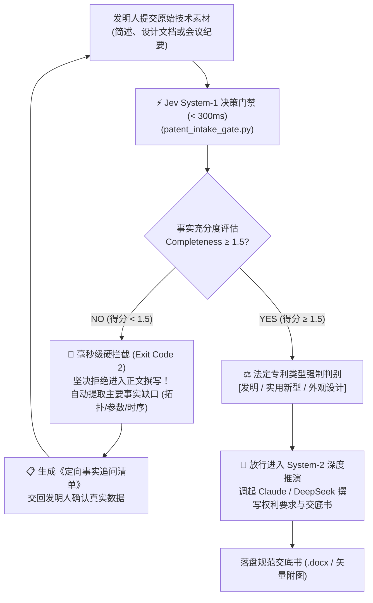

<div align="center">

# jev-patent-disclosure

### 融合 TypeSafe Jev 快思考决策门禁的中国专利（交底/申请/检索/解读）智能体套件

[](LICENSE)
[](https://www.python.org/)
[](https://openrouter.ai)
[](https://www.cnipa.gov.cn/)
[](https://agentskills.io)
[](https://github.com/hoangngochuong24947-gif/jev-patent-disclosure/pulls)

**拒绝大模型“胡乱脑补技术事实”：用 300ms System-1 快思考门禁守住专利真实性底线，再交由 System-2 深度推演撰写**  
覆盖专利点挖掘、事实完备度量规打分、法定类型判决、交底书/申请文件自动生成、审查意见答复与 Obsidian 专利地图。

[为什么需要 Jev？](#-为什么需要-jev大模型写专利的致命盲点与破局之道) • [双系统认知架构](#-双系统协同认知架构-dual-process-architecture) • [实测对比案例](#-实测对比-before-vs-after) • [8大子技能矩阵](#-8-大子技能矩阵与-jev-赋能拓扑) • [快速开始](#-快速开始-quickstart) • [Agent 生态集成](#-ai-agent-生态集成) • [开源致谢](#-开源溯源与致谢)

</div>

---

## ⚡ 为什么需要 Jev？大模型写专利的致命盲点与破局之道

### 1. 传统大模型写专利的“致命原罪”：技术事实幻觉与强行脑补

在过去一年中，很多研发团队尝试用 ChatGPT、Claude 或 DeepSeek 帮工程师“一键生成专利交底书”。然而在专利法律实务中，这往往导致灾难性的后果：

* **研发素材天生简陋**：工程师给出的原始材料通常只有一两句话或几张草图（例如：“*我们做了一个基于注意力机制的显存优化算法，效果很好*”）。
* **大模型的“讨好型人格”与脑补陷阱**：通用大语言模型（LLM）被训练为无论输入多么模糊，都要尽可能输出结构完整、篇幅浩繁的文本。面对关键技术空白时，大模型会**自作主张编造具体的算法公式、捏造不存在的电路连接图、甚至虚构关键物理参数**！
* **致命后果**：
  1. **被国家知识产权局（CNIPA）直接驳回**：违反我国《专利法》第二十六条第三款（说明书必须充分公开发明事实，达到本领域技术人员能够实现的程度）；
  2. **技术保护范围变形**：AI 脑补的虚假技术特征被写进独立权利要求，导致专利不仅无法保护真实业务，更可能造成重大技术失密或法律效力归零。

> **专利实务最高铁律**：  
> **宁可向发明人连发三轮事实追问清单，也绝不容许 AI 替工程师臆造哪怕一个技术特征！**

---

### 2. Jev 的破局方案：毫秒级前置“事实与法定类型”初审门禁

大模型进行全篇交底书撰写往往需要 20~60 秒的高密度深度推演（慢思考 System-2）。如果直接让大模型起草，一旦素材不充分，就是浪费算力去生成一份毫无意义的“废纸”。

本项目通过引入 **TypeSafe Jev（快思考 System-1 决策引擎）**，在动笔写正文前执行 **< 300ms** 的结构化快门禁（`patent_intake_gate.py`）：



#### Jev 门禁输出三大核心维度：
1. **事实完备度量规打分（Completeness Score L0 / L1 / L2）**：
   - **Level 0（得分 < 1.0）**：仅有商业宣传或粗浅设想，无实现机理 $\to$ **立即硬拦截**，严禁生成！
   - **Level 1（得分 1.0 ~ 1.5）**：有基本逻辑但缺少边界阈值、电路拓扑或公式 $\to$ 给出警示并精准追问；
   - **Level 2（得分 $\ge$ 1.5）**：具备充分技术实施例与可复现参数 $\to$ **绿灯放行**。
2. **法定专利类型强制判决（Statutory Category Decision）**：
   - 在 300ms 内裁定方案属于“发明（方法/算法/化学）”、“实用新型（实体构造/电路硬件）”还是“外观设计”。
   - **法律级防呆**：我国专利法明文规定实用新型不保护纯方法与算法，Jev 从源头强制分流，避免报错类型导致退案。
3. **公知常识区分度概率（Novelty Distinction Prob $p \in [0, 1]$）**：
   - 快速评估该方案是否明显属于通用教科书已有常识，协助发明人快速提炼出真正具有新颖性的“区别技术特征”。

---

## 🔬 双系统协同认知架构 (Dual-Process Architecture)

本项目采用人类顶尖专职专利代理师的认知模型构建：

| 认知系统 | 担当引擎 | 响应时延 | 职责定位与工作流 |
| :--- | :--- | :--- | :--- |
| **System-1 (快思考反射)** | **TypeSafe Jev** | **< 300ms** | **门禁守门员与仲裁者**：<br>① 素材完备度客观打分；<br>② 专利法定类型（发明/实用/外观）精准裁定；<br>③ 事实缺口诊断与追问清单生成；<br>④ 避免算力浪费与幻觉污染。 |
| **System-2 (慢思考推演)** | **Claude 3.5 Sonnet / DeepSeek-R1 / GPT-4o** | **10s ~ 60s** | **深度技术撰写与权要编排**：<br>① 独立权利要求主权提取与前序/特征划分；<br>② 从属权利要求阶梯式保护网织造；<br>③ 结合背景技术对标已有在先文献；<br>④ 自动导出含编号引出线的标准黑白附图。 |

---

## 📈 实测对比: Before vs. After

运行项目内置的对比实测脚本：
```bash
python3 examples/demo_jev_intake_comparison.py
```

### 案例 A：粗糙模糊素材（传统大模型必翻车）
> **输入素材**：  
> *“我们做了一个基于人工智能的大模型显存优化方案。通过某种算法把显存动态换入换出，从而在单卡上训练超大模型，效果非常好，节省了很多显存。”*

* **传统大模型处理**：  
  大模型自作主张虚构了 `0x7FFF` 寄存器地址、编造了一套虚假的 Page-Rank 显存置换公式，洋洋洒洒输出了 4,000 字全是胡说八道的“废纸交底书”。
* **Jev 增强型处理（本项目实测输出）**：
  ```json
  {
    "factual_completeness": 0.22,
    "patent_category": "invention",
    "is_ready_to_draft": false,
    "exit_code": 2,
    "missing_element": "missing_algorithm_steps",
    "action_guidance": "NEEDS_FACTS: Material sufficiency level 0.22 < 1.5. Primary gap: 'missing_algorithm_steps'. Ask inventor for targeted facts before drafting."
  }
  ```
  **结果**：300ms 毫秒级硬拦截！立即打回，并提示发明人补充具体置换触发阈值与 CUDA 流调用逻辑，坚决不瞎编！

---

### 案例 B：完备工程实施例
> **输入素材**：  
> *“技术方案：一种用于扩散生成模型的高通量拓扑显存动态卸载方法。硬件包含 PCIe 4.0 x16 互连，主控为 24GB VRAM GPU 与 128GB Host RAM。监控线程以 10ms 周期采集显存水位；超过 88% 阈值时拦截前向激活张量计算；将非活跃层分块（64MB）通过异步 CUDA Stream 卸载至 Host RAM；反向到达前 5ms 预取换入……”*

* **Jev 增强型处理（本项目实测输出）**：
  ```json
  {
    "factual_completeness": 1.75,
    "patent_category": "invention",
    "is_ready_to_draft": true,
    "exit_code": 0,
    "missing_element": "sufficient",
    "action_guidance": "READY: Material sufficiency level 1.75 >= 1.5. Proceed to Step 2–8 drafting under category 'invention'."
  }
  ```
  **结果**：评分 1.75，绿灯放行！立即调起专利撰写引擎，在 30 秒内生成严密合规的权利要求书体系与 Word 交底书。

---

## 🗂️ 8 大子技能矩阵与 Jev 赋能拓扑

<table width="100%">
<colgroup>
<col width="22%">
<col width="12%">
<col>
<col width="22%">
</colgroup>
<thead>
<tr>
<th align="left">子技能</th>
<th align="left">名称</th>
<th align="left">核心能力与 CNIPA 标准对齐</th>
<th align="left">⚡ Jev System-1 赋能点</th>
</tr>
</thead>
<tbody>
<tr>
<td><a href="skills/patent-disclosure/README.md"><code>patent-disclosure</code></a></td>
<td>交底书编写</td>
<td>将研发资料转变为所里可直接处理的交底书（发明/实用/外观分套模板，支持 Word 导出与 Mermaid 框图）。</td>
<td><strong>前置挂载事实门禁</strong>：<code>patent_intake_gate.py</code> 毫秒级打分，不充分坚决打回追问，完备才动笔。</td>
</tr>
<tr>
<td><a href="skills/patent-application/README.md"><code>patent-application</code></a></td>
<td>申请文件生成</td>
<td>直接产出符合《专利法实施细则》的权要书、说明书、技术摘要与黑白附图。</td>
<td><strong>法定类型强制对齐</strong>：依据 Jev 裁决类型（发明 vs 实用新型）强制套用严格法律书式。</td>
</tr>
<tr>
<td><a href="skills/patent-docket/README.md"><code>patent-docket</code></a></td>
<td>案卷会稿对打</td>
<td>角色扮演“交底工程师 vs 资深代理师”：多轮质询与事实核对。</td>
<td><strong>一致性裁决哨兵</strong>：在多轮对抗中监督每一轮对话，防止多轮后 AI 产生漂移与自相矛盾。</td>
</tr>
<tr>
<td><a href="skills/patent-reader/README.md"><code>patent-reader</code></a></td>
<td>通俗解读</td>
<td>将晦涩难懂的 PDF 专利转化为人话笔记，并自动在 Obsidian 中建立双链图谱。</td>
<td><strong>核心特征毫秒级抓取</strong>：快速提取技术功效点，加速图谱入库。</td>
</tr>
<tr>
<td><a href="skills/patent-map/README.md"><code>patent-map</code></a></td>
<td>专利地图探索</td>
<td>本地启动独立可视化服务：语义地形沙盘、申请人四象限、引证网络与功效矩阵。</td>
<td><strong>分类与聚类预判定</strong>：辅助专利技术功效矩阵的高速拓扑归类。</td>
</tr>
<tr>
<td><a href="skills/patent-oa/README.md"><code>patent-oa</code></a></td>
<td>审查答复辅助</td>
<td>针对一通、二通通知书拆解法条，起草答辩书与权利要求书修改稿。</td>
<td><strong>修改超范围初检</strong>：初审答复稿修改是否超出原说明书与权利要求书范围。</td>
</tr>
<tr>
<td><a href="skills/patent-search/README.md"><code>patent-search</code></a></td>
<td>著录检索</td>
<td>按申请人、分类号检索，或根据技术方案反向倒推精准检索式。</td>
<td><strong>关键词提炼与布尔式初筛</strong>：300ms 快速生成检索要素表。</td>
</tr>
<tr>
<td><a href="skills/patent-exam-policy/README.md"><code>patent-exam-policy</code></a></td>
<td>政策简报</td>
<td>紧跟国知局最新审查口径与政策修订简报。</td>
<td><strong>审查规则版本对齐</strong>：确保交底书式符合最新规章标准。</td>
</tr>
</tbody>
</table>

---

## 🚀 快速开始 (Quickstart)

### 1. 克隆仓库与安装依赖

```bash
git clone https://github.com/hoangngochuong24947-gif/jev-patent-disclosure.git
cd jev-patent-disclosure

# 安装依赖
pip install -r requirements.txt
```

### 2. 配置密钥

本项目具备**零依赖原生 HTTP 自愈能力**：
```bash
# 设置 OpenRouter API Key (支持 Jev Alpha Decisions 端点)
export OPENROUTER_API_KEY="sk-or-v1-..."
# 或者直接在项目根目录下创建 .env 文件写入 OPENROUTER_API_KEY=xxx
```
*(注：如果你的环境中已安装 `jev` CLI，脚本将自动优先使用本地二进制工具)*

### 3. 一键运行测试

```bash
# 1. 运行双系统对比演示 (直观感受 Jev 如何拦截脑补)
python3 examples/demo_jev_intake_comparison.py

# 2. 传入自己的技术材料运行 300ms 门禁初审
python3 skills/patent-disclosure/tools/patent_intake_gate.py --text "你的技术方案描述..."

# 3. 输出纯 JSON 便于程序集成
python3 skills/patent-disclosure/tools/patent_intake_gate.py --mock-brief --json
```

---

## 🤖 AI Agent 生态集成

本项目原生支持主流 AI Agent 开发环境，遵循标准 Agent Skills 规范：

### 1. Claude Code
```bash
ln -s "$(pwd)" ~/.claude/skills/patent-disclosure-skill
```

### 2. Antigravity (Google DeepMind)
```bash
ln -s "$(pwd)" ~/.gemini/config/skills/patent-disclosure-skill
```

### 3. OpenCode / Cursor
```bash
ln -s "$(pwd)" ~/.agents/skills/patent-disclosure-skill
```

挂载完成后，当用户输入“*帮我写个交底书*”、“*帮我梳理专利点*”时，Agent 将自动调用 `patent_intake_gate.py` 进行 300ms 前置初查：只有事实完备才起草，若有缺口则立刻列出问题清单向用户追问！

---

## 📜 开源溯源与致谢

本项目基于开源项目 [handsomestWei/patent-disclosure-skill](https://github.com/handsomestWei/patent-disclosure-skill) 进行深度本土化与 Jev 快思考架构重塑。

* 原作者：[@handsomestWei](https://github.com/handsomestWei)
* 原项目协议：MIT License
* 本项目改动：引入 TypeSafe Jev System-1 毫秒级决策门禁、重构双系统防幻觉流水线、提供免外部 CLI 的原生 HTTP 自愈能力与可执行对比案例。

感谢开源社区对知识产权工程化的大力支持！

---

## 🏷️ GitHub Topics & Tags

`jev` `jeb` `typesafe-jev` `system-1-decision` `patent-disclosure` `patent-mining` `cnipa` `ai-patent` `llm-agents` `agentskills` `anti-hallucination`

---

## 📄 开源协议

本项目继续遵循 [MIT License](LICENSE) 许可协议。
